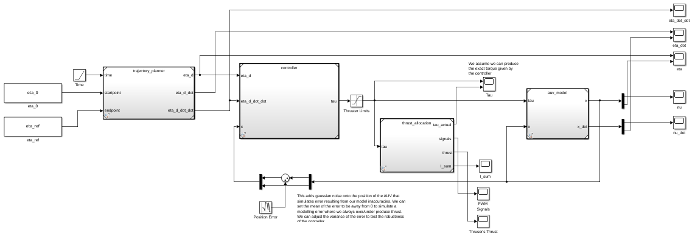

# Control Systems

This is where we design, simulate and tune our control systems and evaluate how they perform on a mathematical model of our AUV using MATLAB Simulink simulations. Below is a diagram showcasing the realistic simulation of the control system (described in the systems section).

## Get Started
This repo is in the form of a Simulink project, and requires MATLAB 2019b to correctly operate. To get started, clone this repo, open up MATLAB and in the MATLAB folder navigator, right click the `control-systems` folder and click `Add to Path > Selected Folders and Subfolders`. Next click the `Subbots_controller.prj`file within the `control-systems` directory. This will bring up a Project pane in the application where you are able to open and run the models.

## Params
In this folder are the parameter scripts for the control system corresponding to the version of the AUV given by the year in the script's name. When you open up the Simulink project, the current parameter script is run which populates the MATLAB workbench with the parameters which then can be used in the Simulink models.

## Systems
This folder contains the systems that can be run/exported, they can be described as such.
#### control_system.slx
This is the control system that is exported to C++ code that can be used by our ROS system. You can use the embedded coder Simulink app to export the code, which will package the exported system into a zip file found in the `Build` folder. (Note: make sure that all the PID blocks are set to discrete, this has to be done for the exporting process to work, but after doing this, you need to set the blocks back to continuous for the simulations to work)

#### ideal_simulation.slx
This is the ideal simulator which tests our control system under the assumption that we can produce the exact desired thrust/torque given by the controller. The control system is evaluated on `auv_model.slx`, which is our mathematical model of our AUV. The controller should produce the exact trajectory under these conditions, as in the eta scope shouldn't show any signs of divergence from the desired trajectory.

#### real_simulation.slx
This is the real life simulator which attempts to best model the control system according to the mechanical/electrical constraints of our AUV, and also errors in our modelling. It also tests the outputs of `thrust_allocation.slx` which is the block that converts thrust to PWM signals, and is used in our actual control system. The control system is again evaluated on `auv_model.slx`, however this time we add error to the model's outputs to simulate inaccuracies.

#### ros_simulation.slx
This system uses the real simulation to send ROS Pose messages to the UWSim simulator on the topic /g500/pose.

#### simX_cosimulation.slx
This system is used to test our control system using the physical simulator SimulationX. It uses the real simulation to send each thruster's thrust given by the thrust allocator block to the SimulationX model, which uses the actual SolidWorks model of our AUV and includes realistic hydrodynamcis, and then the resulting state of the SimulationX model is sent back to Simulink to be used in the control system. 
